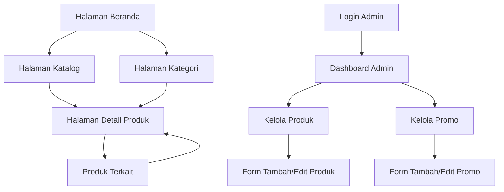

# Product Requirements Document - E-Katalog Sederhana

## 1. Product Overview

E-Katalog adalah aplikasi web sederhana untuk menampilkan dan mengelola katalog produk secara digital. Aplikasi ini memungkinkan pengguna untuk melihat daftar produk, mencari produk berdasarkan nama atau kategori, dan melihat detail lengkap setiap produk.

Aplikasi ini ditujukan untuk bisnis kecil dan menengah yang ingin memiliki katalog produk online yang mudah diakses dan dikelola.

## 2. Core Features

### 2.1 User Roles

| Role       | Registration Method             | Core Permissions                                                         |
| ---------- | ------------------------------- | ------------------------------------------------------------------------ |
| Pengunjung | Tidak perlu registrasi          | Dapat melihat katalog produk, mencari, dan melihat detail produk         |
| Admin      | Login dengan username dan password | Dapat mengelola produk (CRUD), mengatur promo/diskon, mengelola kategori |

### 2.2 Feature Module

Aplikasi e-katalog terdiri dari halaman-halaman utama berikut:

1. **Halaman Beranda**: hero section, navigasi kategori, daftar produk unggulan dengan promo
2. **Halaman Katalog**: daftar semua produk, filter kategori, pencarian produk, badge promo
3. **Halaman Detail Produk**: informasi lengkap produk, gambar produk, spesifikasi, harga promo
4. **Halaman Kategori**: daftar produk berdasarkan kategori tertentu
5. **Halaman Login Admin**: form login untuk admin
6. **Dashboard Admin**: panel kontrol untuk mengelola produk dan promo
7. **Halaman Kelola Produk**: CRUD produk dengan upload gambar
8. **Halaman Kelola Promo**: pengaturan diskon dan periode promo

### 2.3 Page Details

| Page Name             | Module Name            | Feature description                                                  |
| --------------------- | ---------------------- | -------------------------------------------------------------------- |
| Halaman Beranda       | Hero Section           | Menampilkan banner utama dengan informasi bisnis dan call-to-action  |
| Halaman Beranda       | Navigasi Kategori      | Menampilkan daftar kategori produk utama dengan ikon                 |
| Halaman Beranda       | Produk Unggulan        | Menampilkan 6-8 produk terpilih dengan badge promo dan harga coret   |
| Halaman Katalog       | Daftar Produk          | Menampilkan semua produk dengan badge promo, harga normal dan diskon |
| Halaman Katalog       | Filter Kategori        | Menyediakan filter berdasarkan kategori produk dan status promo      |
| Halaman Katalog       | Pencarian              | Memungkinkan pencarian produk berdasarkan nama                       |
| Halaman Detail Produk | Informasi Produk       | Menampilkan nama, harga normal, harga promo (coret), deskripsi       |
| Halaman Detail Produk | Galeri Gambar          | Menampilkan multiple gambar produk dengan thumbnail                  |
| Halaman Detail Produk | Produk Terkait         | Menampilkan produk serupa atau dalam kategori yang sama              |
| Halaman Kategori      | Daftar Produk Kategori | Menampilkan produk dalam kategori tertentu dengan info promo         |
| Halaman Login Admin   | Form Login             | Input username dan password untuk autentikasi admin                |
| Dashboard Admin       | Statistik              | Menampilkan jumlah produk, kategori, dan promo aktif                 |
| Dashboard Admin       | Menu Navigasi          | Akses cepat ke kelola produk, kategori, dan promo                    |
| Halaman Kelola Produk | Daftar Produk Admin    | Tabel produk dengan aksi edit, hapus, dan tambah produk baru         |
| Halaman Kelola Produk | Form Produk            | Input nama, harga, deskripsi, kategori, upload gambar                |
| Halaman Kelola Promo  | Daftar Promo           | Tabel promo aktif dengan periode dan persentase diskon               |
| Halaman Kelola Promo  | Form Promo             | Input produk, persentase diskon, tanggal mulai dan berakhir          |

## 3. Core Process

**Alur Pengunjung:**
Pengguna dapat mengakses aplikasi melalui halaman beranda, kemudian menjelajahi produk melalui kategori atau menggunakan fitur pencarian. Dari halaman katalog atau kategori, pengguna dapat mengklik produk untuk melihat detail lengkap dengan informasi promo jika tersedia.

**Alur Admin:**
Admin melakukan login melalui halaman login, kemudian mengakses dashboard untuk mengelola produk dan promo. Admin dapat menambah, edit, atau hapus produk, serta mengatur promo dengan periode dan persentase diskon.

## 4. User Interface Design

### 4.1 Design Style

* **Warna Utama**: #2563eb (biru), #f8fafc (abu-abu terang)

* **Warna Sekunder**: #64748b (abu-abu), #ffffff (putih)

* **Style Button**: Rounded corners dengan shadow, hover effects

* **Font**: Inter atau system font, ukuran 14-16px untuk body text

* **Layout**: Card-based design dengan grid responsive

* **Icon**: Menggunakan Lucide React icons atau Heroicons

### 4.2 Page Design Overview

| Page Name             | Module Name        | UI Elements                                                        |
| --------------------- | ------------------ | ------------------------------------------------------------------ |
| Halaman Beranda       | Hero Section       | Background gradient, centered text, CTA button dengan warna primer |
| Halaman Beranda       | Navigasi Kategori  | Grid 4 kolom dengan card, icon dan nama kategori                   |
| Halaman Beranda       | Produk Unggulan    | Grid responsive dengan badge "PROMO", harga coret dan harga diskon |
| Halaman Katalog       | Daftar Produk      | Grid responsive dengan badge promo, harga normal dan diskon        |
| Halaman Katalog       | Filter & Pencarian | Sidebar dengan filter kategori, status promo, dan search input     |
| Halaman Detail Produk | Layout Produk      | 2 kolom: gambar di kiri, info dengan harga coret di kanan          |
| Halaman Detail Produk | Galeri Gambar      | Main image dengan thumbnail gallery di bawah                       |
| Halaman Login Admin   | Form Login         | Card centered dengan input username, password, dan tombol login     |
| Dashboard Admin       | Layout Dashboard   | Sidebar navigasi, header dengan logout, konten utama dengan cards  |
| Dashboard Admin       | Statistik Cards    | 3-4 cards dengan icon, angka besar, dan label statistik            |
| Kelola Produk         | Tabel Produk       | DataTable dengan kolom gambar, nama, harga, kategori, aksi         |
| Kelola Produk         | Form Produk        | Modal atau halaman terpisah dengan upload gambar dan input fields  |
| Kelola Promo          | Tabel Promo        | DataTable dengan produk, diskon, periode, status aktif/nonaktif    |
| Kelola Promo          | Form Promo         | Modal dengan dropdown produk, input persentase, date picker        |

### 4.3 Responsiveness

Aplikasi menggunakan pendekatan mobile-first dengan breakpoint:

* Mobile: 320px - 768px

* Tablet: 768px - 1024px

* Desktop: 1024px+

