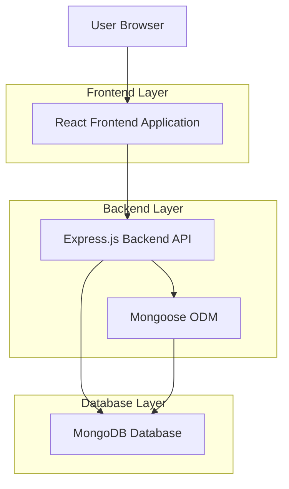
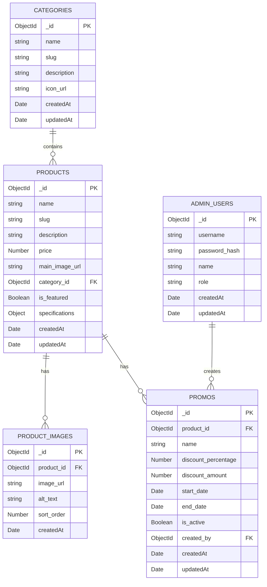

# Technical Architecture Document - E-Katalog Sederhana

## 1. Architecture Design



## 2. Technology Description

* Frontend: React\@18 + TailwindCSS\@3 + Vite

* Backend: Express.js\@4 + Node.js

* Database: MongoDB + Mongoose ODM

* Icons: Lucide React

* Routing: React Router DOM

* State Management: React Context API

* Image Storage: Cloudinary atau local storage

* Authentication: JWT (JSON Web Tokens)

## 3. Route Definitions

| Route            | Purpose                                                        |
| ---------------- | -------------------------------------------------------------- |
| /                | Halaman beranda dengan hero section dan produk unggulan        |
| /katalog         | Halaman katalog dengan semua produk dan fitur pencarian        |
| /kategori/:slug  | Halaman kategori untuk menampilkan produk berdasarkan kategori |
| /produk/:id      | Halaman detail produk dengan informasi lengkap                 |
| /admin/login     | Halaman login untuk admin                                      |
| /admin/dashboard | Dashboard admin dengan statistik dan navigasi                  |
| /admin/produk    | Halaman kelola produk (CRUD)                                   |
| /admin/promo     | Halaman kelola promo dan diskon                                |

## 4. API Definitions

### 4.1 Core API

API menggunakan Express.js dengan Mongoose untuk operasi database MongoDB:

**Produk API**

```typescript
// Get all products
GET /api/products
Response: { success: boolean, data: Product[] }

// Get product by ID
GET /api/products/:id
Response: { success: boolean, data: Product }

// Search products
GET /api/products/search?q=searchTerm
Response: { success: boolean, data: Product[] }

// Mongoose implementation
const products = await Product.find();
const product = await Product.findById(productId);
const searchResults = await Product.find({
  name: { $regex: searchTerm, $options: 'i' }
});
```

**Kategori API**

```typescript
// Get all categories
GET /api/categories
Response: { success: boolean, data: Category[] }

// Get products by category
GET /api/categories/:slug/products
Response: { success: boolean, data: Product[] }

// Mongoose implementation
const categories = await Category.find();
const products = await Product.find({ category_id: categoryId }).populate('category_id');
```

**Admin Authentication API**

```typescript
// Admin login
POST /api/auth/login
Request: { username: string, password: string }
Response: { success: boolean, token: string, admin: AdminUser }

// Admin logout
POST /api/auth/logout
Response: { success: boolean, message: string }

// Verify admin token
GET /api/auth/verify
Headers: { Authorization: 'Bearer <token>' }
Response: { success: boolean, admin: AdminUser }

// Mongoose implementation
const admin = await AdminUser.findOne({ username });
const isValid = await bcrypt.compare(password, admin.password_hash);
const token = jwt.sign({ adminId: admin._id }, JWT_SECRET);
```

**Admin Produk API**

```typescript
// Create product (Admin only)
POST /api/admin/products
Headers: { Authorization: 'Bearer <token>' }
Request: ProductData
Response: { success: boolean, data: Product }

// Update product (Admin only)
PUT /api/admin/products/:id
Headers: { Authorization: 'Bearer <token>' }
Request: ProductData
Response: { success: boolean, data: Product }

// Delete product (Admin only)
DELETE /api/admin/products/:id
Headers: { Authorization: 'Bearer <token>' }
Response: { success: boolean, message: string }

// Mongoose implementation
const product = await Product.create(productData);
const updatedProduct = await Product.findByIdAndUpdate(productId, productData, { new: true });
const deletedProduct = await Product.findByIdAndDelete(productId);
```

**Promo API**

```typescript
// Get active promos
GET /api/promos/active
Response: { success: boolean, data: Promo[] }

// Create promo (Admin only)
POST /api/admin/promos
Headers: { Authorization: 'Bearer <token>' }
Request: PromoData
Response: { success: boolean, data: Promo }

// Update promo (Admin only)
PUT /api/admin/promos/:id
Headers: { Authorization: 'Bearer <token>' }
Request: PromoData
Response: { success: boolean, data: Promo }

// Mongoose implementation
const activePromos = await Promo.find({
  is_active: true,
  start_date: { $lte: new Date() },
  end_date: { $gte: new Date() }
}).populate('product_id');
const promo = await Promo.create(promoData);
const updatedPromo = await Promo.findByIdAndUpdate(promoId, promoData, { new: true });
```

## 5. Data Model

### 5.1 Data Model Definition



### 5.2 Mongoose Schemas

**Category Schema**

```javascript
const mongoose = require('mongoose');

const categorySchema = new mongoose.Schema({
  name: {
    type: String,
    required: true,
    maxlength: 100
  },
  slug: {
    type: String,
    required: true,
    unique: true,
    maxlength: 100
  },
  description: {
    type: String
  },
  icon_url: {
    type: String
  }
}, {
  timestamps: true
});

// Create index
categorySchema.index({ slug: 1 });

module.exports = mongoose.model('Category', categorySchema);
```

**Product Schema**

```javascript
const productSchema = new mongoose.Schema({
  name: {
    type: String,
    required: true,
    maxlength: 200
  },
  slug: {
    type: String,
    required: true,
    unique: true,
    maxlength: 200
  },
  description: {
    type: String
  },
  price: {
    type: Number,
    required: true,
    min: 0
  },
  main_image_url: {
    type: String
  },
  category_id: {
    type: mongoose.Schema.Types.ObjectId,
    ref: 'Category'
  },
  is_featured: {
    type: Boolean,
    default: false
  },
  specifications: {
    type: mongoose.Schema.Types.Mixed
  }
}, {
  timestamps: true
});

// Create indexes
productSchema.index({ slug: 1 });
productSchema.index({ category_id: 1 });
productSchema.index({ is_featured: 1 });
productSchema.index({ name: 'text' });

module.exports = mongoose.model('Product', productSchema);
```

**Product Image Schema**

```javascript
const productImageSchema = new mongoose.Schema({
  product_id: {
    type: mongoose.Schema.Types.ObjectId,
    ref: 'Product',
    required: true
  },
  image_url: {
    type: String,
    required: true
  },
  alt_text: {
    type: String,
    maxlength: 200
  },
  sort_order: {
    type: Number,
    default: 0
  }
}, {
  timestamps: true
});

// Create indexes
productImageSchema.index({ product_id: 1 });
productImageSchema.index({ sort_order: 1 });

module.exports = mongoose.model('ProductImage', productImageSchema);
```

**Promo Schema**

```javascript
const promoSchema = new mongoose.Schema({
  product_id: {
    type: mongoose.Schema.Types.ObjectId,
    ref: 'Product',
    required: true
  },
  name: {
    type: String,
    required: true,
    maxlength: 200
  },
  discount_percentage: {
    type: Number,
    min: 0,
    max: 100
  },
  discount_amount: {
    type: Number,
    min: 0
  },
  start_date: {
    type: Date,
    required: true
  },
  end_date: {
    type: Date,
    required: true
  },
  is_active: {
    type: Boolean,
    default: true
  },
  created_by: {
    type: mongoose.Schema.Types.ObjectId,
    ref: 'AdminUser'
  }
}, {
  timestamps: true
});

// Create indexes
promoSchema.index({ product_id: 1 });
promoSchema.index({ is_active: 1 });
promoSchema.index({ start_date: 1, end_date: 1 });

module.exports = mongoose.model('Promo', promoSchema);
```

**Admin User Schema**

```javascript
const bcrypt = require('bcryptjs');

const adminUserSchema = new mongoose.Schema({
  username: {
    type: String,
    required: true,
    unique: true,
    maxlength: 50
  },
  password_hash: {
    type: String,
    required: true
  },
  name: {
    type: String,
    required: true,
    maxlength: 100
  },
  role: {
    type: String,
    default: 'admin',
    enum: ['admin', 'super_admin']
  }
}, {
  timestamps: true
});

// Create indexes
adminUserSchema.index({ username: 1 });

// Hash password before saving
adminUserSchema.pre('save', async function(next) {
  if (!this.isModified('password_hash')) return next();
  this.password_hash = await bcrypt.hash(this.password_hash, 12);
  next();
});

module.exports = mongoose.model('AdminUser', adminUserSchema);
```

**Initial Data (Seed Script)**

```javascript
const mongoose = require('mongoose');
const Category = require('./models/Category');
const Product = require('./models/Product');
const Promo = require('./models/Promo');
const AdminUser = require('./models/AdminUser');

async function seedDatabase() {
  try {
    // Clear existing data
    await Category.deleteMany({});
    await Product.deleteMany({});
    await Promo.deleteMany({});
    await AdminUser.deleteMany({});

    // Insert sample categories
    const categories = await Category.insertMany([
      {
        name: 'Elektronik',
        slug: 'elektronik',
        description: 'Perangkat elektronik dan gadget',
        icon_url: '/icons/electronics.svg'
      },
      {
        name: 'Fashion',
        slug: 'fashion',
        description: 'Pakaian dan aksesoris',
        icon_url: '/icons/fashion.svg'
      },
      {
        name: 'Rumah Tangga',
        slug: 'rumah-tangga',
        description: 'Peralatan dan perlengkapan rumah',
        icon_url: '/icons/home.svg'
      },
      {
        name: 'Olahraga',
        slug: 'olahraga',
        description: 'Peralatan dan perlengkapan olahraga',
        icon_url: '/icons/sports.svg'
      }
    ]);

    // Insert sample products
    const elektronikCategory = categories.find(cat => cat.slug === 'elektronik');
    const fashionCategory = categories.find(cat => cat.slug === 'fashion');

    const products = await Product.insertMany([
      {
        name: 'Smartphone Android',
        slug: 'smartphone-android',
        description: 'Smartphone Android dengan kamera 48MP dan RAM 8GB',
        price: 3500000,
        main_image_url: '/images/smartphone.jpg',
        category_id: elektronikCategory._id,
        is_featured: true,
        specifications: {
          ram: '8GB',
          storage: '128GB',
          camera: '48MP',
          battery: '4000mAh'
        }
      },
      {
        name: 'Kaos Polo Pria',
        slug: 'kaos-polo-pria',
        description: 'Kaos polo berkualitas tinggi untuk pria',
        price: 150000,
        main_image_url: '/images/polo-shirt.jpg',
        category_id: fashionCategory._id,
        is_featured: true,
        specifications: {
          material: 'Cotton',
          sizes: ['S', 'M', 'L', 'XL']
        }
      }
    ]);

    // Insert sample admin user
    const admin = await AdminUser.create({
      username: 'admin',
      password_hash: 'admin123', // Will be hashed by pre-save hook
      name: 'Administrator',
      role: 'admin'
    });

    // Insert sample promos
    const smartphone = products.find(prod => prod.slug === 'smartphone-android');
    const polo = products.find(prod => prod.slug === 'kaos-polo-pria');

    await Promo.insertMany([
      {
        product_id: smartphone._id,
        name: 'Flash Sale Smartphone',
        discount_percentage: 15.00,
        start_date: new Date('2024-01-01'),
        end_date: new Date('2024-01-31'),
        is_active: true,
        created_by: admin._id
      },
      {
        product_id: polo._id,
        name: 'Diskon Fashion',
        discount_percentage: 20.00,
        start_date: new Date('2024-01-15'),
        end_date: new Date('2024-02-15'),
        is_active: true,
        created_by: admin._id
      }
    ]);

    console.log('Database seeded successfully!');
  } catch (error) {
    console.error('Error seeding database:', error);
  }
}

module.exports = seedDatabase;
```

